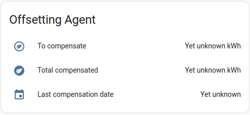

# Compensate your Smart Home's carbon footprint with web3 services.

A Home Assistant integration to compensate CO2 consumed by burning carbon units with the help of a remote agent.

## Concept
Each tonn of CO2 emitted into the atmosphere counts, there are some special carbon units representing the CO2 amounts.
These units may be burnt to "compensate your carbon footprint". More on that one may find [here](https://en.wikipedia.org/wiki/Carbon_credit).
Our team has developed an Agent which may burn these units for you for some fee (since there are testing units now, there is no fee).
This is an integration providing the ability to request that agent and compensate your home's carbon footprint based on the 
energy sensors data. The unique identifier of yours is you blockchain account private key. The entire service is as well based on web3
technologies.


## Installation
1. Get integration files:
* Using HACS:
In the HACS panel, go to integrations and click the big orange '+' button. Search for 'Web3 Carbon Footprint Offsetting' 
and click 'Install this repository in HACS'.
* Manually:
Clone the [repository](https://github.com/PaTara43/carbon-offsetting-web3-integration) into the `custop_components` folder of your Home
Assistant config (create one if you don't have it), navigate to the folder `carbon-offsetting-web3-integration` and copy the
integration files to the `custom_components` folder of your HomeAssistant:
```shell
homeassistant@ubuntu:~/.homeassistant/custom_components$ 

git clone https://github.com/PaTara43/carbon-offsetting-web3-integration
cp -r carbon-offsetting-web3-integration/custom_components/carbon_offsetting_web3 .
rm -rf carbon-offsetting-web3-integration/
```
This wierd file structure is due to HACS requirements.

2. Restart HA to load the integration into HA.
3. Go to Settings -> Devices & Services -> Integrations and click the 'Add Integration' button. Look for 'Web3 Carbon
Footprint Offsetting' and click to add it.

## Configuration 
For this integration you need an [account](https://wiki.robonomics.network/docs/en/create-account-in-dapp/) in [Robonomics
Network](https://robonomics.network/). Save the seed when creating an account, it will be required at integration setup.
If you use [Robonomics HomeAssistant integration](https://github.com/airalab/homeassistant-robonomics-integration/), you
may want to use Controller seed.


To set up the integration, you need to select the entities representing **total** amount of energy your Home consumes,
there is a multiple choice selector for that. Similarly, if you have any energy production (e.g. solar panels), pick entities
representing them in the production entities selector. You may leave it blank if no production entities.


Input seed of your Robonomics account. The integration use it to sign liability messages when creating liabilities for 
carbon offsetting agent. This will cost you nothing, and the seed won't be sent anywhere.

Next section is dedicated to the IPFS settings. IPFS is used to store liabilities technics data. All the fields are
optional, if you don't specify any gateway, your local one will be used. If you want to use a remote one, paste its URL
into the corresponding field and set auth header. This integration supports Web3-auth headers, the ones that require your
seed as well. If you use conventional authentication method, paste the login and password.

*Note! Use multiaddr format!*


## Use

Once the integration is set, three entities will be created, representing the amount of fossil kWh to compensate, last
compensation date and total amount of compensated kWh.



They are unknown values yet. To get them, go to `Developer Tools->Services` and call `Web3 Carbon Footprint Offsetting: Get amount of kWh uncompensated.`
service. It will update your values based on your home parameters.


Call `Web3 Carbon Footprint Offsetting: Compensate an amount of produced CO2 by burning carbon units` to compensate the
displayed amount. After that, the values on the lovelace will be updated. You can do this any time you want, all the
calculations will be performed automatically.

## Troubleshooting

Error *"PubSub Timeout"* means that the response message was not delivered to your system. That is due to sum issues in Robonomics
PubSub technology which is actively developed. In case of requesting amount of kWh to compensate, call the service once again,
and when the compensation call timed out, call the `Web3 Carbon Footprint Offsetting: Get amount of kWh uncompensated.` in case
the burn happened, but never reported.

Other errors require the user to check logs of the integration.

To get access to logs, enable debug logs in HomeAssistant's `configuration.yml` by adding the following:
```yaml
logger:
  default: warning
  logs:
    custom_components.carbon_offsetting_web3: debug
```

All the logs are store in `home-assistant.log`